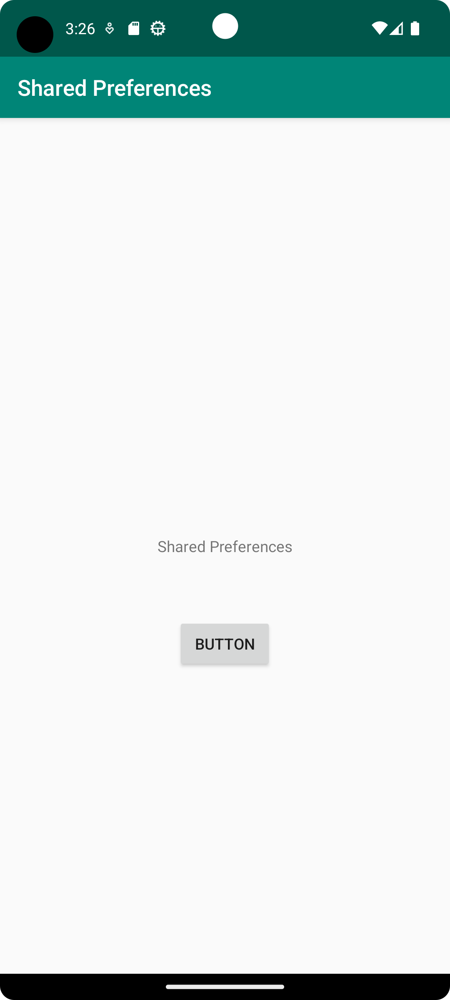
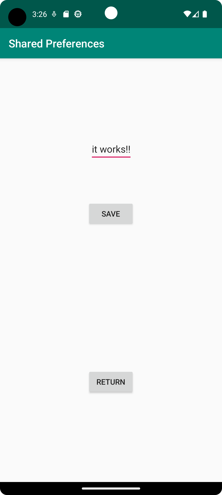

# Rapport

**Skriv din rapport här!**

Började med att skapa en ny activity. Sedan skapade jag en edittext och två knappar
i den nya activityn. Sedan gjorde jag så att en knapp tar dig tillbaka till main activityn,
och en annan knapp som sparar texten man skriver in i edittext. Med hjälp av onResume()
så visar sedan MainActivity texten som sparades i min andra activity. 


```
@Override
    public void onResume() {
        super.onResume();
        SharedPreferences sharedPreferences = getSharedPreferences(SecondActivity.editedText, MODE_PRIVATE);
        String textSecond = sharedPreferences.getString(SecondActivity.editedText, "");
        textView.setText(textSecond);
    }
    


    public void saveText() {
        SharedPreferences sharedPref = getSharedPreferences(editedText, MODE_PRIVATE);
        SharedPreferences.Editor editor = sharedPref.edit();
        editor.putString(editedText, editText.getText().toString()).apply();
    }

```

Bilder läggs i samma mapp som markdown-filen.





Läs gärna:

- Boulos, M.N.K., Warren, J., Gong, J. & Yue, P. (2010) Web GIS in practice VIII: HTML5 and the canvas element for interactive online mapping. International journal of health geographics 9, 14. Shin, Y. &
- Wunsche, B.C. (2013) A smartphone-based golf simulation exercise game for supporting arthritis patients. 2013 28th International Conference of Image and Vision Computing New Zealand (IVCNZ), IEEE, pp. 459–464.
- Wohlin, C., Runeson, P., Höst, M., Ohlsson, M.C., Regnell, B., Wesslén, A. (2012) Experimentation in Software Engineering, Berlin, Heidelberg: Springer Berlin Heidelberg.
